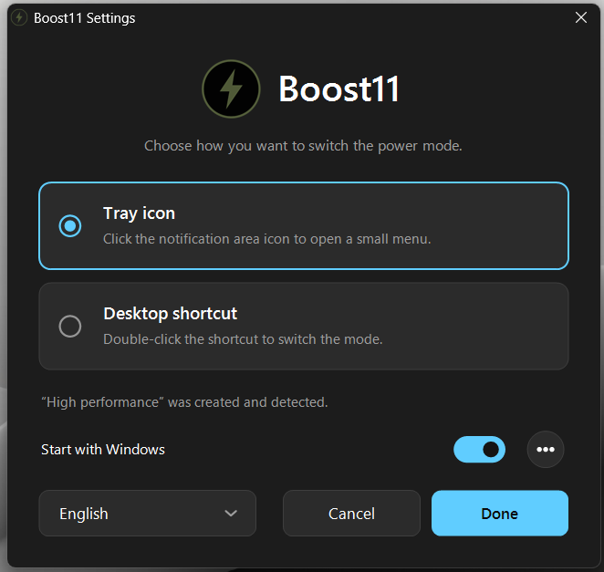
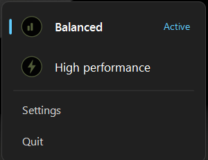

<div align="center">


# Boost11

**Switch Windows between *Balanced* and *High performance* in one click.**
A tiny, dependency-free power mode switcher written in C++.

[](#requirements)
[](LICENSE)
[](https://github.com/morrisonion/Boost11/stargazers)
[](https://github.com/morrisonion/Boost11/commits)

</div>

---

## Screenshots




## Requirements

- Windows 11/Windows 10


## Information
The settings menu lets you choose the language and whether Boost11 should start with Windows (tray mode only).

Settings are stored in `%APPDATA%\Boost11\config.ini`.

> If you move `Boost11.exe`, run the exe again so the desktop shortcut points to the new location.

## Building

Any MinGW-w64 toolchain works (e.g. [w64devkit](https://github.com/skeeto/w64devkit) or [WinLibs](https://winlibs.com/)).

```bat
git clone https://github.com/morrisonion/Boost11.git
cd Boost11
build.bat
```

`build.bat` compiles the resources (`windres`) and links a static `Boost11.exe` with `-lgdiplus -lgdi32 -luser32 -lshell32 -lshlwapi -lole32 -luuid -lpowrprof -ldwmapi -ladvapi32 -lshcore`.


## How it works

- Plans are discovered by running `powercfg -l` (hidden) and matching the well-known GUIDs, with name matching as fallback. The result is cached in `config.ini`.
- Modes are switched with `PowerSetActiveScheme`; the active plan is read with `PowerGetActiveScheme`.
- The overlay is a click-through layered window updated with `UpdateLayeredWindow` for smooth per-pixel alpha fading.
- All UI (wizard, tray menu, language dropdown) is custom-drawn with GDI+ and animated with a simple easing timer.

## License

This project is licensed under the GNUgplv3
